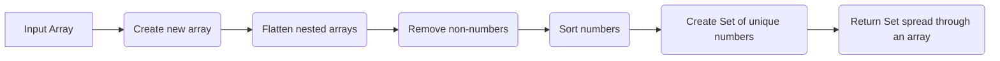

# `extractUniqueNumbers()`

## Extract Unique Numbers from Arrays

[](https://opensource.org/licenses/MIT)

This utility function extracts unique numbers from an array, sorts them in ascending order, and returns the result as an array.

### Mermaid Graph:



### Code

```js
function extractIds(dirtyTypeIds) {
  return [
    ...new Set(
      dirtyTypeIds
        .flat(Infinity)
        .filter(Number)
        .sort((a, b) => a - b)
    )
  ];
}
```

### Usage

```javascript
const extractIds = require('extract-unique-numbers');

const dirtyTypeIds = [1, [3, 2, 2, 5], [4, 3], 6, [5, 7]];
const uniqueNumbers = extractIds(dirtyTypeIds);

console.log(uniqueNumbers); // [1, 2, 3, 4, 5, 6, 7]
```

### API

#### `extractIds(dirtyTypeIds)`

Extracts unique numbers from the input array, sorts them in ascending order, and returns them as an array.

##### Parameters

- `dirtyTypeIds` (Array|Array[]): The input array or array of arrays.

##### Returns

- `Array<number>`: An array containing unique numbers in ascending order.

### Examples

```javascript
const array1 = [2, 1, 3, 1, 4, 5, 3, 2];
const uniqueNumbers1 = extractIds(array1);
console.log(uniqueNumbers1); // [1, 2, 3, 4, 5]

const array2 = [[5, 6], [3, 4, [2]], [1]];
const uniqueNumbers2 = extractIds(array2);
console.log(uniqueNumbers2); // [1, 2, 3, 4, 5, 6]
```

### License

This code is licensed under the [MIT License](https://opensource.org/licenses/MIT).
