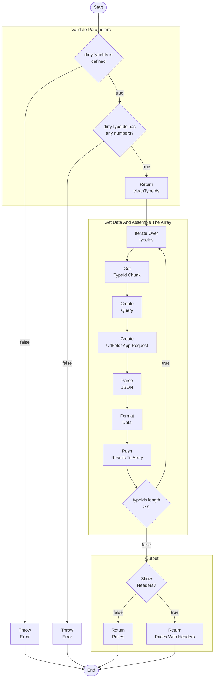

# `loadRegionAggregates()`

## Summary

---

## Table Of Contents

- [loadRegionAggregates()](#loadregionaggregates)
  - [Summary](#summary)
  - [Table Of Contents](#table-of-contents)
  - [Description](#description)
    - [Usage](#usage)
      - [Parameters](#parameters)
    - [Example](#example)
    - [Notes](#notes)
    - [High-level Overview](#high-level-overview)
    - [Flowchart](#flowchart)
  - [Getting Started](#getting-started)
    - [Dependencies](#dependencies)
    - [Installing](#installing)
    - [Executing program](#executing-program)
  - [Help](#help)
  - [Contributing](#contributing)
  - [Authors](#authors)
  - [License](#license)
  - [Acknowledgments](#acknowledgments)

<p align="right">(<a href="#-loadregionaggregates">back to top</a>)</p>

---

## Description

The `loadRegionAggregates()` script is designed to **efficiently load data** for **all** _type IDs_ on the market **within** the _Google Apps Script_ **runtime limit**. It provides an automated way to retrieve _aggregate information_ for multiple _type IDs_ in a _specified region_. The _script_ includes _error handling_ to ensure **smooth execution**.

---

### Usage

To use the `loadRegionAggregates` script, follow these steps:

1. Provide the necessary parameters:

#### Parameters

The function takes up to three parameters. Only one is required:

| Required | Parameter     | Data Type                                                                                |Summary | Default Value         |
| -------- | ------------- | --- |----------------------------------------------------------------------------------------- | --------------------- |
| [x]      | `priceIds`    | Can be a `Number` or an `Array` of `Number`s or an `Array` of `Array`s                   |A list of type IDs for which you want to retrieve aggregate data. Make sure the variable is defined and contains the desired type IDs. | `!defined`            |
| [ ]      | `regionId`    | a `String` or `Number` representing the _region ID_ for the market from which to get data | The ID of the region for which you want to fetch data. If not provided, it defaults to `10000002`, which represents the "The Forge" region in Eve Online. | 10000002(_The Forge_) |
| [ ]      | `showHeaders` | `Boolean` | optional flag indicating whether to include headers in the output                         | `TRUE`                |

1. Execute the script.

   - Ensure that the `loadRegionAggregates` function is called with the appropriate parameters.
   - The script will handle the retrieval of aggregate data for the specified type IDs in the specified region.

2. Retrieve the output.
   - If `includeHeaders` is set to `true`, the output will be a 2D array with column headers and the corresponding aggregated price data.
   - If `includeHeaders` is set to `false`, the output will be a 2D array containing only the aggregated price data.

### Example

Here's an example of how to use the `loadRegionAggregates` script:

```javascript
// Define the type IDs for which you want to retrieve aggregate data
const priceIds = [34, 56, 78, 90];

// Call the loadRegionAggregates function with the required parameters
const result = loadRegionAggregates(priceIds);

// Retrieve the output
console.log(result);
```

This example demonstrates how to retrieve aggregate data for the specified type IDs using the `loadRegionAggregates` function. The result will be logged to the console.

### Notes

- Ensure that you have the necessary permissions and access to the market data source (e.g., the `market.fuzzwork.co.uk` API) for the script to function properly.
- If you encounter any issues or errors, make sure to check the error messages and verify that the parameters and inputs are correctly provided.

---

Feel free to customize and enhance the help section based on your specific requirements and any additional information you would like to provide to users.

<p align="right">(<a href="#-loadregionaggregates()">back to top</a>)</p>

---

### High-level Overview

The function returns an array of market data, with each row representing an item type. If the `typeIds` argument is not defined, an error will be thrown. The main function uses `UrlFetchApp.fetch()` to retrieve data from the website and parse it as JSON. The retrieved data is then processed and formatted into a 2D array with the headers included as the first entry based on the value of the `showHeaders` argument. The `Math.random() * 5000` calculation is used to introduce a random sleep time between server requests in order to distribute the load on the server.

<p align="right">(<a href="#-loadregionaggregates()">back to top</a>)</p>

---

### Flowchart



<p align="right">(<a href="#-loadregionaggregates()">back to top</a>)</p>

---

## Getting Started

### Dependencies

- Describe any prerequisites, libraries, OS version, etc., needed before installing program.
- ex. Windows 10

<p align="right">(<a href="#-loadregionaggregates()">back to top</a>)</p>

---

### Installing

- How/where to download your program
- Any modifications needed to be made to files/folders

<p align="right">(<a href="#-loadregionaggregates()">back to top</a>)</p>

---

### Executing program

- How to run the program
- Step-by-step bullets

### Code

```js
"use strict";

const emailAddress = "" ?? false;
const emailUa = (emailAddress) 
  ? `email: ${emailAddress} 
  : null;

/**
 * @summary Loads region aggregates for the given price IDs.
 * @param {number[]|string[]} priceIds - List of type IDs.
 * @param {number} [regionId=10000002] - Region ID. Defaults to 10000002 (The Forge).
 * @param {boolean} [includeHeaders=true] - Whether to include headers in the result. Defaults to true.
 * @returns {Array<Array<number|string>>} - Array of aggregated prices.
 * @throws {string} - Throws an error if priceIds parameter is not defined.
 */
function loadRegionAggregates(
  priceIds,
  regionId = 10000002,
  includeHeaders = true
) {
  // Check if priceIds parameter is defined
  if (typeof priceIds === "undefined") {
    throw 'Required variable, "priceIds" is not defined! Need a list of type IDs!';
  }

  const config = {
    batchSize: 100,
    fetchOptions: {
      method: "get",
      payload: "",
      "User-Agent": `
  Mozilla/5.0 (
    compatible; 
    Google-Apps-Script;
    beanserver;
    +https://script.google.com;
    id: UAEmdDd-YOcQl6-sJDzwyIBrAH0s5A6DHjow;
    email: ${email}
  )`,
    },
    // comment out (//) any headers you don't want in the output   
    headers: [
      "Buy Volume",
      "Buy Weighted Average",
      "Buy Max",
      //'Buy Min',
      "Buy Std Dev",
      "Buy Median",
      "Buy Percentile",
      "Sell Volume",
      "Sell Weighted Average",
      //'Sell Max',
      "Sell Min",
      "Sell Std Dev",
      "Sell Median",
      "Sell Percentile",
    ],
    propertyMappings: {
      volume: /Volume/i,
      weightedAverage: /Weighted Average/i,
      max: /Max/i,
      min: /Min/i,
      stddev: /Std Dev/i,
      median: /Median/i,
      percentile: /Percentile/i,
    },
  };

  // Map the headers to properties based on the defined property mappings
  const properties = config.headers.map(item => {
    const mapping = Object.entries(config.propertyMappings).find(([_, regex]) =>
      regex.test(item)
    );

    const [propertyKey] = mapping && mapping;
    const categoryKey = item && item.split(" ")[0]; // Extract the category key from the header

    return mapping ? `${categoryKey.toLowerCase()}.${propertyKey}` : null;
  });

  /**
   * Fetches aggregates data from the API for the specified batches and region ID.
   *
   * @param {Array<Array<number|string>>} batches - Array of batches containing type IDs.
   * @param {number} regionId - Region ID.
   * @returns {Array<object>} - Array of fetched responses.
   */
  const fetchAggregatesData = (batches, regionId) => {
    const domain = "https://market.fuzzwork.co.uk/";
    const url = `${domain}aggregates/?region=${regionId}&types=`;
    const { fetchOptions } = config;
    return UrlFetchApp.fetchAll(
      batches.map(batch => ({ url: url + batch.join(","), fetchOptions }))
    );
  };

  /**
   * Returns an array of clean type IDs by removing duplicates and filtering out non-numeric values.
   *
   * @param {number[]|string[]} priceIds - List of type IDs.
   * @returns {number[]} - Array of clean type IDs.
   */
  const getCleanTypeIds = priceIds => {
    return Array.from(new Set([priceIds].flat(Infinity).filter(Number)));
  };

  /**
   * Splits the array of type IDs into batches based on the defined batch size.
   *
   * @param {number[]} typeIds - Array of type IDs.
   * @returns {Array<Array<number>>} - Array of batches.
   */
  const splitIntoBatches = typeIds => {
    const { batchSize } = config;
    return Array.from(
      { length: Math.ceil(typeIds.length / batchSize) },
      (_, index) => {
        const start = index * batchSize;
        const end = start + batchSize;
        return typeIds.slice(start, end);
      }
    );
  };

  /**
   * Processes the fetched responses and extracts the required data.
   *
   * @param {Array<object>} responses - Array of fetched responses.
   * @param {number[]} typeIds - Array of type IDs.
   * @returns {Array<object>} - Array of extracted data.
   */
  const processResponses = (responses, typeIds) => {
    const extractedData = [];

    responses.forEach((response, index) => {
      const { batchSize } = config;
      const json = JSON.parse(response.getContentText());
      if (json) {
        const chunk = typeIds.slice(index * batchSize, (index + 1) * batchSize);
        chunk.forEach(entry => {
          const data = json[entry];
          const extractedEntry = properties.reduce((obj, prop) => {
            if (prop) {
              const [objectKey, propertyKey] = prop.split(".");
              if (
                data &&
                data[objectKey] &&
                data[objectKey][propertyKey] !== undefined
              ) {
                const value = +data[objectKey][propertyKey];
                obj[prop] = value;
              }
            }
            return obj;
          }, {});

          extractedData.push(extractedEntry);
        });
      }
    });

    return extractedData;
  };

  const cleanTypeIds = getCleanTypeIds(priceIds);
  const batches = splitIntoBatches(cleanTypeIds);
  const responses = fetchAggregatesData(batches, regionId);
  const aggregatedPrices = processResponses(responses, cleanTypeIds);

  return includeHeaders
    ? [
        config.headers,
        ...aggregatedPrices.map(row => properties.map(prop => row[prop])),
      ]
    : aggregatedPrices.map(row => properties.map(prop => row[prop]));
}
```

<p align="right">(<a href="#-loadregionaggregates()">back to top</a>)</p>

---

## Help

For any questions or assistance, please open an issue in the repository.

<p align="right">(<a href="#-loadregionaggregates()">back to top</a>)</p>

---

## Contributing

Contributions are what make the open source community such an amazing place to learn, inspire, and create. Any contributions you make are **greatly appreciated**.

If you have a suggestion that would make this better, please fork the repo and create a pull request. You can also simply open an issue with the tag "enhancement".
Don't forget to give the project a star! Thanks again!

1. Fork the Project
2. Create your Feature Branch (`git checkout -b feature/AmazingFeature`)
3. Commit your Changes (`git commit -m 'Add some AmazingFeature'`)
4. Push to the Branch (`git push origin feature/AmazingFeature`)
5. Open a Pull Request

<p align="right">(<a href="#-loadregionaggregates()">back to top</a>)</p>

---

## Authors

- [Fuzzy Steve]
- [PhobiaCide]

<p align="right">(<a href="#-loadregionaggregates()">back to top</a>)</p>

---

## License

This project is licensed under the MIT License - see the LICENSE.md file for details

<p align="right">(<a href="#-loadregionaggregates()">back to top</a>)</p>

---

## Acknowledgments

- [CCP Games]
- [Fuzzy Steve]

<p align="right">(<a href="#-loadregionaggregates()">back to top</a>)</p>

---
