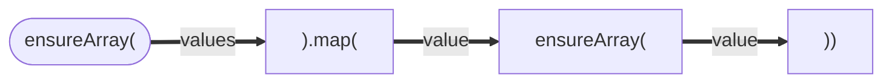

# `ensure2dArray()`

Ensures that the input is converted into a 2-dimensional array.
If the input is already a 2-dimensional array, it is returned as is.
If the input is a 1-dimensional array, each element is wrapped in an array and returned as a 2-dimensional array.
If the input is not an array, it is wrapped in a 2-dimensional array and returned.

### Dependencies

| Dependency      | Info                                                                  |
| --------------- | --------------------------------------------------------------------- |
| `ensureArray()` | Makes at least two and potentially many more calls to `ensureArray()` |

### Flowchart



### Code

```js
/**
 * @summary Ensures that the input data is a two-dimensional array.
 * @description This function takes an input data and checks if it is a two-dimensional array. If the input data is not an array, it wraps it in a single-element array. If the input data is already a two-dimensional array, it returns the data as-is.
 *
 * @param {*} values - The input data, assumed to be an array of arrays.
 * @returns {Array[]} - The input data as a two-dimensional array.
 */
function ensure2dArray(values) {
  return ensureArray(values).map((value) => ensureArray(value));
}
```
