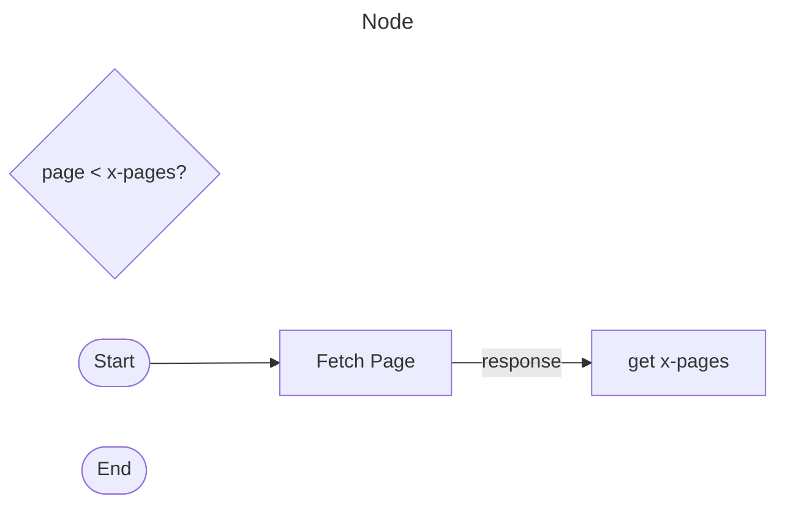

# `fetchAllPages()`

## Summary

### Code

```js
/**
 * @format
 * @name fetchAllPages
 * @version 1.0.0
 * @date 11/26/2022
 * @author PhobiaCide
 * @license MIT License
 * @copyright © 2022 Andrew Amason
 * @summary Fetches all existing pages of an ESI endpoint response
 * @description Fetches the first page of an Eve Swagger Interface (ESI) api request and determines the total number of pages to be fetched. Then, it fetches them all and returns them as an array of objects.
 * @param {string} url - The address to which to make the api call
 * @param {string} options - Optional standard fetch parameters
 * @return {array}
 */
function fetchAllPages(url, options) {
  /**
   * @constant
   * @alias fetchApiPage
   * @summary Fetches a single response page
   * @description
   * @param {number} page - The number of the desired page
   * @returns {(object|Error)} - The server response or a new error if server response code is anything other than 200
   */
  const fetchApiPage = (page = 1) => {
    /**
     * @constant
     * @alias fetchResponse
     * @summary Makes
     * @returns
     */
    const fetchResponse = () => {
      const response = UrlFetchApp.fetch(`${url}${page}`, options);
      const code = response.getResponseCode();
      return code == 200
        ? response
        : new Error(
            `HTTP request unsuccessful at ${url}${page}, ${options}. Server response: ${response.getResponseCode()}.`
          );
    };
    if (fetchResponse != null) {
      const quantity = fetchResponse.getHeaders()[`x-pages`];
      const json = JSON.parse(fetchResponse.getContentText());

      return page < quantity ? json.concat(fetchApiPage(page + 1)) : json;
    }
  };
  return fetchApiPage();
}
```


